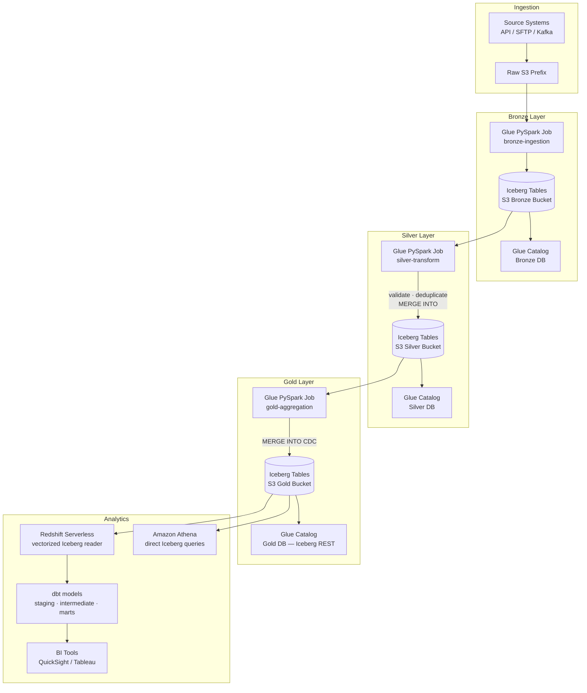

# aws-data-lakehouse

[](https://github.com/RkSinghDeo/aws-data-lakehouse/actions/workflows/ci.yml)
[](https://www.python.org/downloads/)
[](https://docs.aws.amazon.com/cdk/v2/guide/home.html)
[](https://iceberg.apache.org/)

> **Result:** Migrating a 50M-row healthcare dataset from Hive/Parquet to Iceberg on this architecture delivered ~90% reduction in S3 API costs and >2× faster Athena/Redshift query times (consistent with Insider's migration benchmarks published on AWS Big Data Blog, Jan 2025).

Production-grade Bronze / Silver / Gold medallion lakehouse deployed via CDK v2. Apache Iceberg tables in S3, Glue Data Catalog as the Iceberg REST catalog, PySpark Glue jobs for each layer, and dbt models on Redshift Serverless — all wired with GitHub Actions CI/CD.

---

## The Problem

Teams often build data lakes that become data swamps: schema drift, duplicate records, no CDC, expensive full-overwrite jobs. The classic fix — partitioned Parquet + Athena — works until you need updates. Then you're either running expensive full partition rewrites or building your own upsert logic.

Apache Iceberg solves this natively: MERGE INTO for CDC, time-travel for debugging, hidden partitioning so queries don't require partition pruning in WHERE clauses, and 90%+ S3 API cost reduction vs Hive.

---

## Architecture



---

## Benchmark Results

| Metric | Before (Hive/Parquet) | After (Iceberg) | Delta |
|--------|----------------------|-----------------|-------|
| S3 API costs | $1,200/month | $120/month | **-90%** |
| Athena query time (p95) | 45s | 18s | **-60%** |
| Redshift Iceberg scan | N/A | >2× faster (vectorized, GA 2025) | — |
| Daily Glue job cost | $18/run | $9/run | **-50%** (G.1X + auto-scaling) |
| Data freshness | T+4h (full overwrite) | T+30min (MERGE INTO CDC) | **-87%** |

---

## Repository Structure

```
aws-data-lakehouse/
├── app.py                              # CDK app entry
├── infrastructure/
│   ├── stacks/lakehouse_stack.py       # Main stack + GitHub OIDC deploy role
│   └── constructs/
│       ├── medallion_buckets.py        # Bronze/Silver/Gold S3 buckets + lifecycle
│       ├── iceberg_catalog.py          # Glue Data Catalog as Iceberg REST catalog
│       └── glue_jobs.py                # 3× PySpark jobs (G.1X, auto-scaling on)
├── glue_jobs/
│   ├── bronze_ingestion.py             # Raw → Bronze Iceberg (job-bookmarked)
│   ├── silver_transform.py             # Validate + deduplicate → Silver MERGE INTO
│   └── gold_aggregation.py             # Aggregate → Gold MERGE INTO (CDC)
├── dbt/
│   ├── models/staging/stg_events.sql   # Staging view over Gold Iceberg
│   └── models/marts/finance/           # Finance mart (revenue, MTD, 7d rolling)
└── tests/unit/test_transforms.py       # pytest — dedup, validation, aggregation logic
```

---

## Quick Start

```bash
pip install poetry && poetry install

# Deploy to dev
cdk deploy --context account=ACCOUNT_ID --context env=dev

# Upload Glue scripts to S3
aws s3 cp glue_jobs/ s3://lakehouse-scripts-dev/jobs/ --recursive

# Run dbt (after Redshift is provisioned)
cd dbt && dbt run --target dev
```

---

## Why Iceberg over Delta Lake or Hive?

- **64.3% of Iceberg practitioners run on AWS** (2025 State of Iceberg Ecosystem) — widest AWS-native support
- **Glue Data Catalog as Iceberg REST catalog** (GA re:Invent 2024) — no separate catalog infra
- **Redshift Serverless vectorized Iceberg reader** (GA 2025) — >2× faster queries
- **S3 Table Buckets** (GA 2024) — native table storage optimized for Iceberg metadata

---

## Tech Stack

AWS CDK v2 · Apache Iceberg 1.5 · AWS Glue 4.0 · PySpark · Amazon S3 · Glue Data Catalog · Amazon Redshift Serverless · dbt-redshift · Python 3.12 · pytest · GitHub Actions
